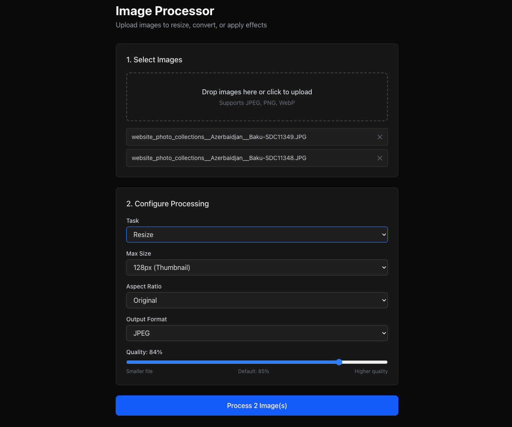

# Image Processor

## Description

A web developer-focused image processor for batch optimization and format conversion. Designed to streamline common web development workflows like creating WebP images, responsive thumbnails, and optimized assets.

Supported operations:

- **Resize** - Create thumbnails and responsive images
- **Format conversion** - JPEG, WebP, PNG with quality control
- **Grayscale** - Convert to monochrome
- **Rotate** - Auto-correct orientation from EXIF data
- **Blur** - Apply blur effects
- **Web optimization** - Progressive JPEG, WebP compression

## Web GUI

A browser-based interface for the image processor. Currently runs on localhost only. Web deployment may be added in the future.



### Quick Start

```bash
# Start both API and frontend
./dev-cli/manage.sh dev

# Or separately:
./dev-cli/manage.sh api      # http://localhost:8000
./dev-cli/manage.sh frontend # http://localhost:3000
```

### Features

- Drag-and-drop file upload
- Multiple file processing
- Task selection: resize, grayscale, blur, rotate
- Output format: WebP, JPEG, PNG
- Quality control with format-specific defaults
- Progress indication
- Download as ZIP

## Command Line Usage

The image processor features a [Click-based CLI](https://click.palletsprojects.com/) for command-line usage.

### Get Help

```bash
image-processor --help
```

### Basic Usage

```bash
# Basic image processing
image-processor <input-dir> --output <output-dir> --task resize

# Web optimization: Convert to WebP with quality control
image-processor <input-dir> --output <output-dir> --task resize --format webp --quality 80

# High quality JPEG for print
image-processor <input-dir> --output <output-dir> --task resize --format jpeg --quality 95

# Create grayscale thumbnails in WebP format
image-processor <input-dir> --output <output-dir> --task grayscale --format webp --quality 75
```

### Examples

```bash
# Convert images to WebP for faster loading
image-processor <input-dir> --output <output-dir> --task resize --format webp --quality 80

# Create JPEG fallbacks for older browsers
image-processor <input-dir> --output <output-dir> --task resize --format jpeg --quality 85

# Optimize images with progressive JPEG
image-processor <input-dir> --output <output-dir> --task resize --format jpeg --quality 85

# Batch convert to compressed WebP
image-processor <input-dir> --output <output-dir> --task resize --format webp --quality 70
```

### Available Options

- `--output`: Output directory (required, must exist and be empty)
- `--task`: `resize`, `grayscale`, `blur`, `rotate` (required)
- `--format`: `jpeg`, `webp`, `png` (default: jpeg)
- `--quality`: 0-100 compression quality (default: 85 for JPEG, 80 for WebP)

### Important Requirements

- **Output directory must exist and be empty**: Prevents accidental file overwrites
- **No automatic directory creation**: Ensures intentional output placement

## Installation

```bash
# Install with uv (recommended)
cd image_processor
uv sync

# Or install with pip
pip install -e .
```

## Development

This project uses a devcontainer configuration for VSCode with `chezmoi` for dotfile management. See [devcontainer_template](https://github.com/loxosceles/devcontainer_config_template) for details.

### Development Commands

The `manage.sh` script handles development workflows:

```bash
# Test CLI changes without package installation
# Useful when developing CLI features - see changes instantly without rebuild/reinstall cycle
manage.sh image_processor <input-dir> --output <output-dir> --task resize --format webp

# Start web GUI development environment
manage.sh dev --isession

# Run tests
manage.sh test

# Build and install complete package (for final testing)
manage.sh package

# Build and push Docker image
manage.sh build

# Get help
manage.sh --help
```

### Development Workflow

When working on CLI code, use `manage.sh image_processor` to test changes immediately without reinstalling. For final validation, use `manage.sh package` to build and test the installed package.

```bash
# Develop CLI features (instant feedback)
manage.sh image_processor <input-dir> --output <output-dir> --task resize --format webp

# Run tests
manage.sh test

# Final validation with installed package
manage.sh package
image-processor <input-dir> --output <output-dir> --task resize --format webp

# Run tests locally without Docker
uv run pytest
```

## CI/CD

The project includes GitHub Actions for continuous integration:

- **Automated Testing**: Tests run automatically on push/PR to `main` and `dev` branches
- **Docker-based CI**: Uses the same Docker environment as local development
- **Volume Mounting**: Fast test execution without rebuilding containers
